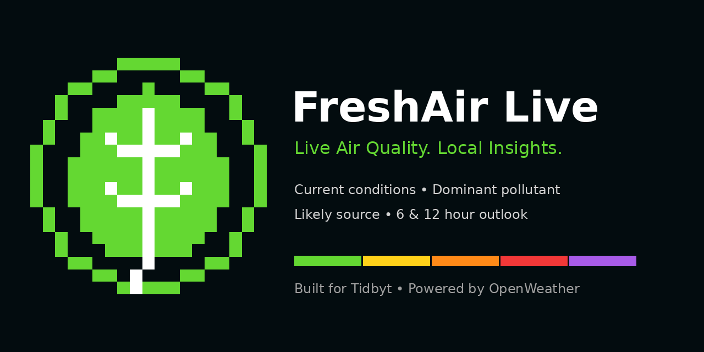
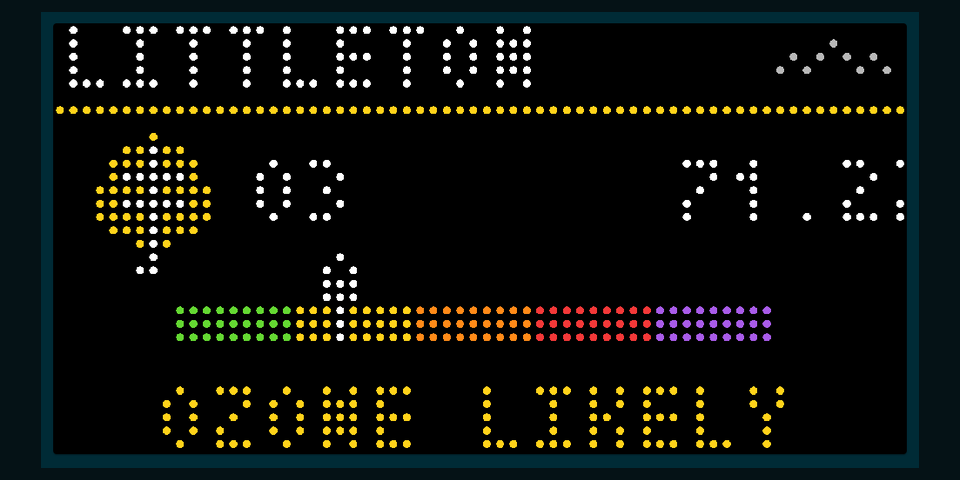

# FreshAir Live

**Live Air Quality. Local Insights.**

FreshAir Live is a Tidbyt app that turns OpenWeather air-pollution data into three glanceable screens:

1. **Current conditions** — overall air-quality status and OpenWeather level.
2. **Dominant pollutant** — concentration, health-scale gauge, and likely source.
3. **Short-term outlook** — current, +6-hour, and +12-hour conditions.



## Screens

### Current conditions


### Dominant pollutant



### Outlook


## Features

- OpenWeather Air Pollution API
- Current air-quality level
- Aspen-inspired status artwork
- Dominant pollutant and concentration
- Five-color health-scale gauge
- Likely-source inference
- +6-hour and +12-hour forecast
- Configurable title, coordinates, animation, and regional marker
- Built-in sample data for local testing

## Air-quality scale

OpenWeather returns an air-quality **level from 1–5**:

| Level | OpenWeather category |
|---:|---|
| 1 | Good |
| 2 | Fair |
| 3 | Moderate |
| 4 | Poor |
| 5 | Very Poor |

FreshAir Live labels the result as `LEVEL 1–5` rather than presenting it as a U.S. EPA AQI value.

## Local preview

```powershell
pixlet serve freshair_live.star
```

Open `http://127.0.0.1:8080`.

For live data, add your key in the browser URL:

```text
http://127.0.0.1:8080/?api_key=YOUR_OPENWEATHER_KEY
```

Do not commit API keys or Tidbyt tokens to GitHub.

## Put it on your Tidbyt

See [`docs/DEPLOY_TO_TIDBYT.md`](docs/DEPLOY_TO_TIDBYT.md).

## Community publication

Before submitting to the Tidbyt Community repository, run:

```powershell
pixlet check freshair_live.star
```

Submission wording is available in [`docs/TIDBYT_SUBMISSION.md`](docs/TIDBYT_SUBMISSION.md).

## License

MIT
